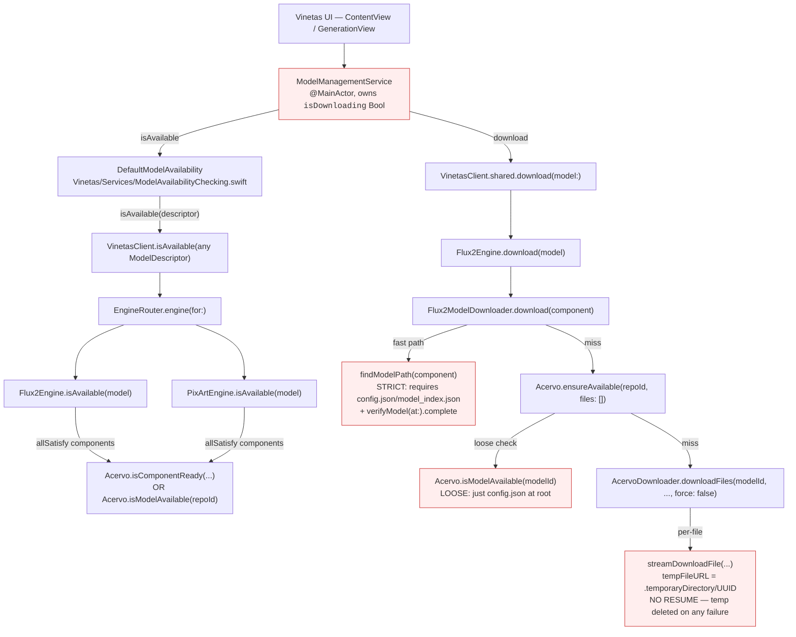
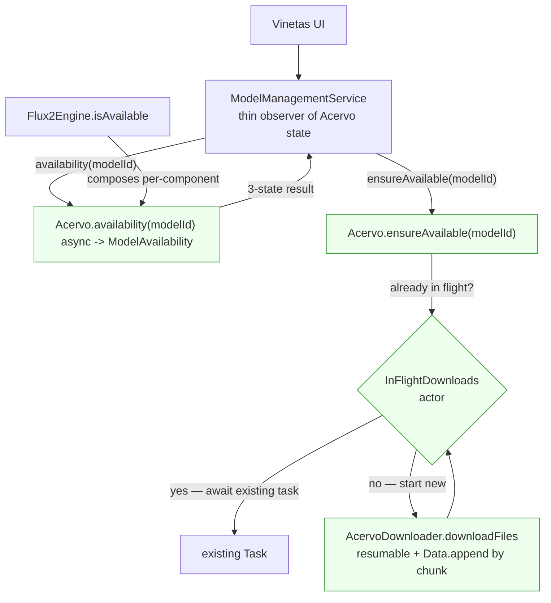

# Model Availability Path — Vinetas → SwiftVinetas → SwiftAcervo

> **Author's note (2026-05-18):** Written while investigating "Vinetas re-downloads the model every time" symptom. The user's stated invariant for the system is:
>
> > Vinetas (and `SwiftVinetas`) should depend entirely on `SwiftAcervo` for model availability. It should ask Acervo for a model's state and get exactly one of three responses:
> >
> > 1. **Not available** — need to download.
> > 2. **Downloading** — already in flight, available soon.
> > 3. **Available** — ready to use.
>
> The point of this doc is to show how it works today, where today's design violates that invariant, and the changes required in each library to restore it.

---

## 1. The invariant the system should hold

A single, async-friendly, three-state status function in `SwiftAcervo` is the *only* source of truth for whether a model can be used right now:

```swift
public enum ModelAvailability: Sendable {
    case notAvailable                       // (1) not on disk
    case downloading(progress: Double)      // (2) in flight; share the in-flight task
    case available                          // (3) on disk and verified
}

public static func availability(_ modelId: String) async -> ModelAvailability
```

Consequences:

- `Vinetas` should not own an `isDownloading` flag — it should subscribe to Acervo state.
- `SwiftVinetas`'s engines (`Flux2Engine`, `PixArtEngine`) should not own a parallel "is component complete" check that uses a *stricter* rule than Acervo. The verification rule belongs in Acervo, and "available" must imply "usable."
- Two callers that ask Acervo to ensure the same model is available **must share** the in-flight download, not start a second one.

## 2. Today's path (current state)



Highlighted in red are the four design hazards behind the user's symptom.

### 2a. Status surfaces today

| Layer | Function | Semantics | Notes |
|---|---|---|---|
| `Vinetas` | `ModelManagementService.isDownloading: Bool` | "Am I, this process, currently driving a download right now" | Resets on process restart. Not shared across callers. |
| `Vinetas` | `DefaultModelAvailability.isAvailable(model)` | `Bool` | Delegates to `VinetasClient.shared.isAvailable`. |
| `SwiftVinetas` | `VinetasClient.isModelAvailable(modelId)` | `Bool` | Calls `VinetasModelManager.isModelAvailable`, which calls `Acervo.isModelAvailable`. |
| `SwiftVinetas` | `VinetasClient.isAvailable(any ModelDescriptor)` (deprecated) | `Bool` | Routes to `engine.isAvailable`. |
| `SwiftVinetas` | `Flux2Engine.isAvailable(model)` | `Bool` (all components AND'd) | Per-component check that ORs `Acervo.isComponentReady(id)` against `Acervo.isModelAvailable(repoId)`. |
| `flux-2-swift-mlx` | `Flux2ModelDownloader.findModelPath(component)` | `URL?` | **Stricter** — also runs `verifyModel(at:)` shard completeness. Used as the *real* fast-path gate for downloads. |
| `SwiftAcervo` | `Acervo.isModelAvailable(modelId)` | `Bool` | Just `config.json` at the repo root. |
| `SwiftAcervo` | `Acervo.isComponentReady(id)` | `Bool` | Per-registered-component check via `ComponentRegistry`. |

There is **no** "currently downloading" state visible to callers, and no contract that "available" means "all weight shards present and verified." The system is two-state where it should be three-state.

### 2b. Why the user is seeing "step 0 of 20 for a long, long time"

This isn't actually re-downloading every time — `downloadFiles` does have a size-match cache check (`AcervoDownloader.swift:1056`) and skips files that match the manifest size. The symptom is the conjunction of three things:

1. **The single-file streaming downloader is pathologically slow.** `streamDownloadFile` (AcervoDownloader.swift:514) iterates `NSURLSession.AsyncBytes` one byte at a time and appends each byte to a `Data` buffer:

   ```swift
   for try await byte in asyncBytes {
       buffer.append(byte)
       if buffer.count >= streamChunkSize { ... }
   }
   ```

   A `sample` of the live process shows ~600 stack-time units in `AcervoDownloader.streamDownloadFile` → `RangeReplaceableCollection.append` → `Data._Representation.replaceSubrange` → `_platform_memmove`, plus more in `AsyncIteratorProtocol.next(isolation:)`. Byte-at-a-time is O(file size) calls into `AsyncBytes.next` and through Swift concurrency executors. A multi-GB safetensors shard takes a very long time even on fast networks.

2. **No resume.** `streamDownloadFile` writes to `temporaryDirectory/UUID` and `try?fm.removeItem(...)` on *any* failure path (AcervoDownloader.swift:500, 548, 563, 585). Closing Vinetas mid-download throws away every byte for the in-flight file. The next run starts over from offset 0.

3. **No in-flight deduplication.** Two callers that hit `ensureAvailable` for the same model both proceed past the `isModelAvailable` check and start independent downloads. Today nothing in Acervo coordinates them.

Per-byte streaming is the dominant cause of "stuck on step 0." Lack of resume is what makes the user perceive it as "starts over every time."

## 3. The target path



### 3a. Required behavioral changes by library

| Library | Change |
|---|---|
| **SwiftAcervo** | Add `Acervo.availability(modelId) async -> ModelAvailability` and an internal `InFlightDownloads` actor that returns a shared `Task<URL, Error>` per `(modelId, file)` so concurrent callers cooperate. |
| **SwiftAcervo** | Tighten `isModelAvailable` semantics: "available" must imply "all manifest files present and size-matched" (today: just `config.json`). The loose check is a footgun (Flux2Engine has had to add a stricter parallel check). |
| **SwiftAcervo** | Make `streamDownloadFile` chunked (`for try await chunk in asyncBytes.chunked(into: streamChunkSize)`) instead of byte-at-a-time. Drops the dominant CPU cost in the user's stack sample. |
| **SwiftAcervo** | Implement resumable downloads: write to `destination + ".part"` (in the model directory, not `temporaryDirectory`), and on retry send `Range: bytes=<offset>-` with the existing size. |
| **SwiftVinetas** | Replace `Flux2Engine.isAvailable`'s per-component file probe with `Acervo.availability(component.repoId)`. Stop ANDing `isComponentReady` against `isModelAvailable` — that's a workaround for #2 above. |
| **flux-2-swift-mlx** | Delete `Flux2ModelDownloader.findModelPath`'s `verifyModel(at:).complete` gate once Acervo's `isModelAvailable` is the strict check. Keep the path-lookup helper, drop the validation. |
| **Vinetas** | Replace `ModelManagementService.isDownloading: Bool` with an observation of `Acervo.availability(modelId)`. The UI's "downloading… 30%" state comes from `.downloading(progress:)`, not from a local Bool. |
| **Vinetas** | Remove the `isDownloading` mutex guard in `download(model:)` — Acervo's in-flight deduplication will handle the "second caller" case. |

### 3b. Three-state semantics

`availability(modelId) async` should return:

- `.available` — every file in the manifest is present on disk with the manifest's size *and* SHA. If files exist but SHA is wrong, `.available` is **false** and the offending files are queued for re-download.
- `.downloading(progress:)` — there is a `Task` registered in `InFlightDownloads` for this `modelId`. `progress` is the existing `AcervoDownloadProgress.overallProgress`. Callers can `await` the in-flight task by calling `ensureAvailable(modelId)` again, which now joins instead of forking.
- `.notAvailable` — no `.part` files, no in-flight task, manifest files absent or size-mismatched.

Note that `.downloading` is transient process-state, not on-disk state. After a hard process kill, `availability` should return `.notAvailable` (because `InFlightDownloads` was lost with the process), regardless of any partial `.part` files. The on-disk `.part` files are picked up as a resume by the *next* `ensureAvailable` call.

## 4. Non-changes

- `AcervoTelemetryReporter` already emits `cacheHit` / `cacheMiss` / `downloadOperationStart` / `downloadOperationComplete`. The three-state API can be derived from existing telemetry without new events.
- `ComponentRegistry` / `ComponentDescriptor` is the right primitive — engines should keep registering their components. The change is that `availability(...)` becomes the read API on top of it.
- `Acervo.sharedModelsDirectory` resolution (App Group / `ACERVO_APP_GROUP_ID`) stays as-is.

## 5. Acceptance signals after the change lands

1. Two parallel calls to `Acervo.ensureAvailable("black-forest-labs/FLUX.2-klein-4B", files: [])` from a unit test only run **one** network download.
2. Killing Vinetas mid-shard and reopening resumes that shard's `.part` file with a `Range:` request, not from byte 0.
3. `sample` of the running process during a download no longer shows `Data.append` and `_platform_memmove` as the dominant cost — chunked appends bring the CPU profile into network-bound territory.
4. `Flux2Engine.isAvailable` and `Flux2ModelDownloader.findModelPath` no longer disagree about whether a model is usable.
